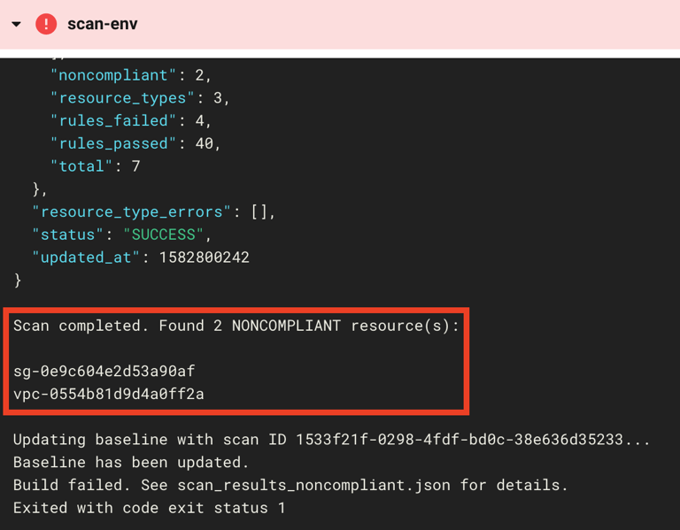
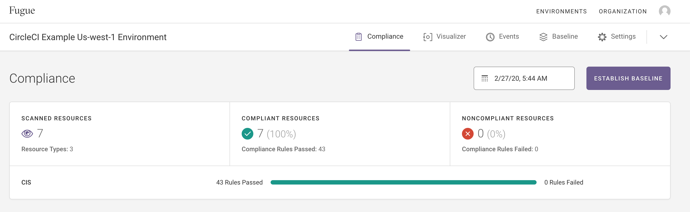
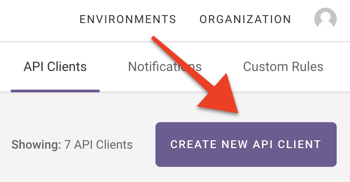
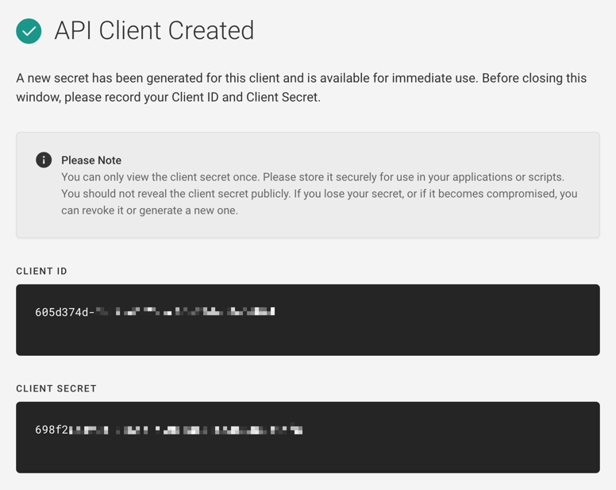
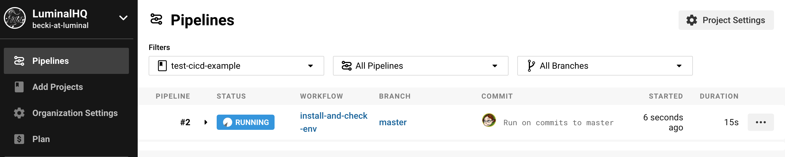
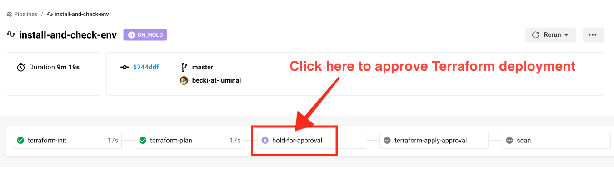
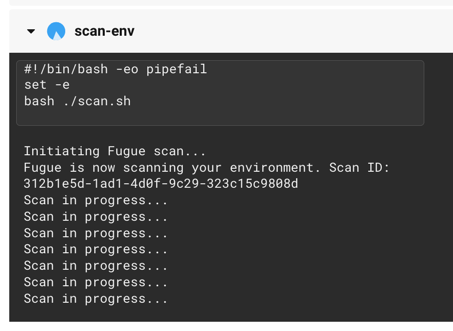
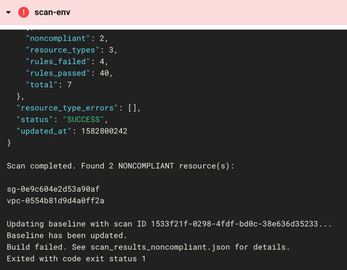
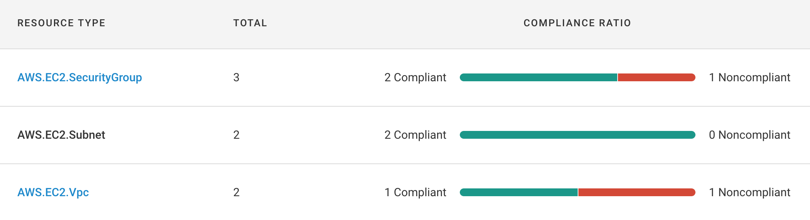
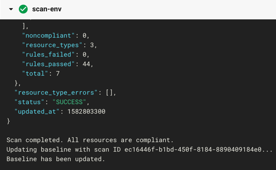

Implementing Fugue CI/CD with Terraform, GitHub, CircleCI, Part 1
=================================================================

**NOTE:** A previous version of this example used the environment variables `FUGUE_CLIENT_ID` and `FUGUE_CLIENT_SECRET`, which have been deprecated. The updated example uses the Fugue CLI, which requires the environment variables `FUGUE_API_ID` and `FUGUE_API_SECRET`. To preserve backwards compatibility, these variables will be set to the values of `FUGUE_CLIENT_ID` and `FUGUE_CLIENT_SECRET` if detected.

- [Getting Started](#getting-started)
- [Steps](#steps)
	- [Step 1: Create Fugue environment](#step-1-create-fugue-environment)
	- [Step 2: Set up GitHub repo](#step-2-set-up-github-repo)
	- [Step 3: Set up Terraform backend](#step-3-set-up-terraform-backend)
		- [Change variables](#change-variables)
		- [Deploy backend infrastructure](#deploy-backend-infrastructure)
		- [Rename backend.tf.backup](#rename-backendtfbackup)
		- [Migrate state](#migrate-state)
		- [Commit and push code to GitHub](#commit-and-push-code-to-github)
	- [Step 4: Configure CircleCI](#step-4-configure-circleci)
		- [Create Fugue API Client](#create-fugue-api-client)
		- [Specify Fugue environment](#specify-fugue-environment)
	- [Step 4a: Understand the pipeline](#step-4a-understand-the-pipeline)
		- [main.tf](#maintf)
		- [.circleci/config.yml](#circleciconfigyml)
		- [scan.sh](#scansh)
	- [Step 5: Watch the CI/CD magic!](#step-5-watch-the-cicd-magic)
		- [Trigger workflow](#trigger-workflow)
		- [Failed build](#failed-build)
		- [Passing build](#passing-build)
- [What's Next?](#whats-next)
	- [Further reading](#further-reading)



[Fugue](https://fugue.co/product) allows you to easily and
programmatically validate your cloud infrastructure for security and
compliance. By integrating Fugue into your CI/CD pipeline, you can
detect resource misconfiguration and compliance violations as part of
every deployment.

In part 1 of this walkthrough, we'll show you how to combine
[Terraform](https://www.terraform.io/),
[GitHub](https://github.com/), [CircleCI](https://circleci.com/),
and [Fugue](https://riskmanager.fugue.co/register) to define, commit,
deploy, and secure infrastructure as code in [Amazon Web Services](https://aws.amazon.com/). **You’ll be deploying infrastructure into your AWS account** (see
[remotestate.tf](https://github.com/fugue/example-tf-circleci/blob/master/remote_state/remotestate.tf)
and
[main.tf](https://github.com/fugue/example-tf-circleci/blob/master/main.tf)).
When implemented, the pipeline looks like this:

1.  User writes Terraform infrastructure as code
2.  User commits and pushes code to GitHub
3.  Pushed commit triggers a CircleCI build
4.  CircleCI uses Terraform to deploy the infrastructure as code in AWS
5.  Fugue scans the infrastructure configuration and assesses compliance state
    1.  If all resources comply with the selected standards, the build succeeds
    2.  If any resources are noncompliant, the build fails
6.  Fugue sets a new baseline to facilitate tracking drift

In [part two](https://github.com/fugue/example-tf-circleci-part-2), we'll demonstrate end-to-end compliance by
adding our open source tool [Regula](https://github.com/fugue/regula)
to the front of the CI/CD pipeline. Regula validates resource
configuration pre-deployment and Fugue ensures it stays compliant
post-deployment.

*Note:* For supplemental information to this walkthrough, including an abbreviated [Quick Start](https://docs.fugue.co/example-tf-circleci.html#tf-circleci-quick-start) and [line-by-line code documentation](https://docs.fugue.co/example-tf-circleci.html#tf-circleci-line-by-line), see the [Fugue docs site](https://docs.fugue.co/example-tf-circleci.html).

Getting Started
---------------

To get started, sign up for a free account with each pipeline component
below. (Hint, hint -- try our free [Fugue Developer](https://riskmanager.fugue.co/register) plan! We'll walk you
through how to [create your first environment](https://docs.fugue.co/helloworld.html).)

-   [Amazon Web Services (AWS)](https://aws.amazon.com/)
-   [GitHub](https://github.com/)
-   [CircleCI](https://circleci.com/)
-   [Fugue](https://riskmanager.fugue.co/register)

Next, install Terraform v0.12 or later. [Download Terraform](https://www.terraform.io/downloads.html), then unzip it and
move it somewhere in your `$PATH`. You can find specific installation
instructions for your operating system in the [Terraform docs](https://learn.hashicorp.com/terraform/getting-started/install.html).

Alternatively, install [tfenv](https://github.com/tfutils/tfenv), a
Terraform version manager. Then, when you get to Step 3, you can just
execute `tfenv install` and it'll install the correct version. It'll
also make your life a lot easier when working with different versions of
Terraform.

Steps
-----

Here's a quick overview of what we'll do today:

1.  [Create a Fugue environment](#step-1-create-fugue-environment)
2.  [Set up a GitHub repo](#step-2-set-up-github-repo)
3.  [Set up Terraform backend infrastructure in AWS](#step-3-set-up-terraform-backend)
4.  [Configure CircleCI](#step-4-configure-circleci)
5.  [Watch the CI/CD magic!](#step-5-watch-the-cicd-magic)

### Step 1: Create Fugue environment

We'll start by creating a Fugue [environment](https://docs.fugue.co/glossary.html#term-environment),
which in this case represents the cloud infrastructure configuration in
a given region of your AWS account. Fugue will survey the resources in
the region and report whether they are compliant with a particular
compliance standard.

Follow the instructions in our [Hello World AWS tutorial](https://docs.fugue.co/helloworld.html) to set up a Fugue
environment. This example uses the following settings:

**Region:**

-   us-west-1 (N. California)

**Resource types:**

-   AWS.EC2.SecurityGroup

-   AWS.EC2.Subnet

-   AWS.EC2.Vpc

**Compliance family:**

-   [CIS AWS Foundations Benchmark](https://docs.fugue.co/glossary.html#term-cis-aws)



Once your Fugue environment is up and running, let's take a look at the
GitHub part of the pipeline.

### Step 2: Set up GitHub repo

GitHub acts as the trigger for the CI/CD pipeline. Pushing commits to
the master branch automatically kicks off a CircleCI build that uses
Terraform to deploy the infrastructure defined in the repo, and Fugue to
assess the infrastructure's compliance state.

For this example, [create a new GitHub repo](https://github.com/new)
([see docs](https://help.github.com/en/github/getting-started-with-github/create-a-repo)).
In your terminal, [git clone](https://git-scm.com/docs/git-clone) your
new repo:

```bash
git clone https://github.com/path-to-your-repository-goes-here.git
```

Next, since we've conveniently created [a repo](https://github.com/fugue/example-tf-circleci) with all the code
you need, you can simply [download the ZIP](https://github.com/fugue/example-tf-circleci/archive/master.zip)
of our
[example-tf-circleci](https://github.com/fugue/example-tf-circleci)
repo and unzip the files into your own repo's directory.

For a description of each file, see the [Fugue docs site](https://docs.fugue.co/example-tf-circleci.html#tf-circleci-list-files).

### Step 3: Set up Terraform backend

*Note:* If you haven't installed Terraform yet, the easiest way to do it
is to install the Terraform version manager
[tfenv](https://github.com/tfutils/tfenv), then run `tfenv install`.
This command installs the version specified in the
[.terraform-version](https://github.com/fugue/example-tf-circleci/blob/master/.terraform-version)
file.

In order to deploy cloud infrastructure with Terraform and have it
"remember" state, we need to set up a
[backend](https://www.terraform.io/docs/backends/index.html) in S3,
where the state will be stored. Otherwise, Terraform will try to create
new infrastructure on each build, and that's not exactly what we want!

There are multiple ways to set up a backend in Terraform, but we've
chosen to [use an S3 backend](https://www.terraform.io/docs/backends/types/s3.html) because
it is secure and simple to set up. We'll use Terraform itself to
provision the infrastructure.

We will save a detailed explanation for a forthcoming blog post, so here
are the highlights of the backend resources we're going to create:

-   An [S3 bucket](https://github.com/fugue/example-tf-circleci/blob/master/remote_state/remotestate.tf#L93) for storing Terraform state

-   A [folder](https://github.com/fugue/example-tf-circleci/blob/master/remote_state/remotestate.tf#L157) in the state bucket to hold state for Terraform projects (there are two in this example -- [remotestate.tf](https://github.com/fugue/example-tf-circleci/blob/master/remote_state/remotestate.tf) and [main.tf](https://github.com/fugue/example-tf-circleci/blob/master/main.tf))

-   A [KMS key](https://github.com/fugue/example-tf-circleci/blob/master/remote_state/remotestate.tf#L166) to enable server-side encryption (SSE) on the state bucket

-   An [S3 bucket](https://github.com/fugue/example-tf-circleci/blob/master/remote_state/remotestate.tf#L8) for storing access logs

-   A [DynamoDB table](https://github.com/fugue/example-tf-circleci/blob/master/remote_state/remotestate.tf#L201) for locking to prevent simultaneous operations on the same resources

We encourage you to take a look at the
[remotestate.tf](https://github.com/fugue/example-tf-circleci/blob/master/remote_state/remotestate.tf)
file when you have a chance to see the specific resources you'll be
deploying into your AWS account.

#### Change variables

**Action required!** Before you can commit and push the copied files to
GitHub, you'll need to make two *small but important edits*:

Change the `XXXXXXXXXXXX` in the bucket name (line 3) to your 12-digit
AWS account ID in two places:

-   [`{project_root}/backend.tf`](https://github.com/fugue/example-tf-circleci/blob/master/backend.tf#L3)

-   [`{project_root}/remote_state/backend.tf.backup`](https://github.com/fugue/example-tf-circleci/blob/master/remote_state/backend.tf.backup#L3)

The reason for the manual edits is that [Terraform does not support
interpolation in backend configurations](https://www.terraform.io/docs/backends/config.html), so
variables cannot be used in the bucket name. These changes ensure that
the bucket names you create are globally unique. You are also free to
provide any name you want in the `backend.tf` and `remotestate.tf`
files provided that the bucket names will be globally unique.

#### Deploy backend infrastructure

Now we'll deploy the backend infrastructure. From the root of your repo,
`cd` into the `remote_state` directory:

```bash
cd remote_state
```

We need to do this in two steps. First, we'll apply the Terraform to
create the backend resources, and then we'll configure the backend and
migrate the state to S3.

Initialize Terraform:

```bash
terraform init
```

Generate a Terraform plan:

```bash
terraform plan
```

You should see output describing 10 resources to be created. If
everything looks good, go ahead and deploy the resources:

```bash
terraform apply
```

Enter "yes" after checking that the plan looks correct, again.

Now, Terraform provisions your infrastructure. You'll see output
describing each resource as it is created.

*Note:* Due to [eventual consistency](https://en.wikipedia.org/wiki/Eventual_consistency), you
may encounter an error message like this while applying the Terraform:
_"Error: Error putting S3 policy: OperationAborted: A conflicting conditional operation is currently in progress against this resource. Please try again."_ In this case, AWS has likely attempted to create a
bucket policy or public access block before the corresponding bucket is
ready. Just wait a couple minutes and run the command again, and the
operation should succeed.

#### Rename backend.tf.backup

After the backend infrastructure has been created, you can implement it
by providing a backend configuration file -- `backend.tf.backup`,
which we need to rename to `backend.tf`. The reason we added the
.backup extension is because you must create the backend infrastructure
before you can use it.

```bash
mv backend.tf.backup backend.tf
```

#### Migrate state

With our configuration file in place, we can now initialize the backend
by initializing the project again:

```bash
terraform init
```

You'll see a message asking if you want to move the existing state to
the new backend. Enter yes, and you should see a confirmation message.

#### Commit and push code to GitHub

The last thing to do with the repo for right now is to commit the new
files and push to GitHub. Move to the root of the repo and stage the
following files:

```bash
cd ..
git add .circleci/ .gitignore .terraform-version Makefile backend.tf config.mk main.tf remote_state/ scan.sh
```

Commit and push the changes:

```bash
git commit -m "Add CI CD example files"
git push
```

With remote state set up in S3 and code pushed to GitHub, we can move
forward to configuring CircleCI.

### Step 4: Configure CircleCI

We need to set up our project so CircleCI can start building it, so
follow the steps on the [Fugue docs site](https://docs.fugue.co/example-tf-circleci.html) to create a CircleCI project (or see the [CircleCI](https://circleci.com/docs/2.0/config-intro/#part-one-hello-its-all-about-the-shell) [docs](https://circleci.com/docs/2.0/hello-world/)).
You'll need to [create an AWS IAM
user](https://docs.aws.amazon.com/IAM/latest/UserGuide/id_users_create.html)
for CircleCI. For the purposes of this example, we've given CircleCI
administrative access so it can deploy infrastructure into our account. (To learn how we created the IAM user, see the [Fugue docs](https://docs.fugue.co/example-tf-circleci.html#how-to-create-the-circleci-iam-user).) 

Next, we need to add the following environment variables:

-   `AWS_ACCESS_KEY_ID`

-   `AWS_SECRET_ACCESS_KEY`

-   `FUGUE_API_ID` (note: `FUGUE_CLIENT_ID` is deprecated)

-   `FUGUE_API_SECRET` (note: `FUGUE_CLIENT_SECRET` is deprecated)

-   `FUGUE_ENV_ID`

To add them, head back to the CircleCI project settings page and select
Environment Variables from the left nav, then select Add Environment
Variable.

In the dialog that pops up, enter the name `AWS_ACCESS_KEY_ID` and
value for the CircleCI user, then select Add Environment Variable.

Repeat the process for the `AWS_SECRET_ACCESS_KEY`.

#### Create Fugue API Client

We're going to return to [Fugue](https://riskmanager.fugue.co) for a
minute. Select Organization from the top-right corner, then navigate to
the [API Clients](https://riskmanager.fugue.co/organization/api) tab
and select Create New API Client:



Enter an API client name, such as CircleCI Example User, and then select
Create API Client.

You'll see a message that your Fugue API client has been created. Copy
the client ID and client secret -- you'll only be able to view the
secret once. (If do you lose the secret, you can [revoke it and create a new one](https://docs.fugue.co/api.html#revoking-or-regenerating-a-secret).)



Back in CircleCI, copy the client ID and secret into the following new
environment variables:

-   `FUGUE_API_ID` (note: `FUGUE_CLIENT_ID` is deprecated)

-   `FUGUE_API_SECRET` (note: `FUGUE_CLIENT_SECRET` is deprecated)

#### Specify Fugue environment

Finally, return to your Fugue environment and copy the environment ID
from the page URL. It'll look something like this:

```bash
https://riskmanager.fugue.co/environments/8fd9e9a9-a27e-4508-1234-123412341234/compliance/rules
```

The environment ID above would be
`8fd9e9a9-a27e-4508-1234-123412341234`.

Back in CircleCI, create a `FUGUE_ENV_ID` environment variable with
the value you just copied.

With CircleCI configured, we're almost ready to kick off the repo's
first build. But before we continue, let's go over what will happen
next.

### Step 4a: Understand the pipeline

To get a better understanding of what we expect to happen during the
CircleCI build, we'll examine the Terraform file, CircleCI
configuration, and scan script.

#### main.tf

[This simple Terraform configuration](https://github.com/fugue/example-tf-circleci/blob/master/main.tf) creates a VPC named
`my-fugue-cicd-vpc` and a default security group in us-west-1. Because
the ingress rule of the default security group allows all traffic, this
resource violates CIS AWS 4-1, 4-2, and 4-3.

#### .circleci/config.yml

Our [CircleCI workflow]((https://github.com/fugue/example-tf-circleci/blob/master/.circleci/config.yml))
specifies the following
jobs:

-   [tf-install](https://github.com/fugue/example-tf-circleci/blob/master/.circleci/config.yml#L14): This command downloads Terraform 0.12.20, unzips it, and moves it to a location within the `$PATH`, `/usr/bin`.

-   [terraform-init](https://github.com/fugue/example-tf-circleci/blob/master/.circleci/config.yml#L24): This installs the Terraform binary, then initializes the project directory. The files are persisted to the workspace so subsequent jobs can access them.

-   [terraform-plan](https://github.com/fugue/example-tf-circleci/blob/master/.circleci/config.yml#L37): This command grabs the files persisted from the last job and generates a Terraform plan.

-   [terraform-apply-approval](https://github.com/fugue/example-tf-circleci/blob/master/.circleci/config.yml#L51): This job is where the Terraform infrastructure as code becomes real infrastructure -- with `terraform apply`.

-   [scan](https://github.com/fugue/example-tf-circleci/blob/master/.circleci/config.yml#L68): After the Terraform has been successfully applied, this job runs the [scan.sh](https://github.com/fugue/example-tf-circleci/blob/master/scan.sh) bash script, which uses the [Fugue CLI](https://docs.fugue.co/cli.html) to kick off a scan of the specified Fugue environment. If any noncompliant resources are detected, the script ensures the build fails.

For a line-by-line explanation of the CircleCI config, see the [Fugue docs site](https://docs.fugue.co/example-tf-circleci.html#tf-circleci-config-yml).

#### scan.sh

The [scan script](https://github.com/fugue/example-tf-circleci/blob/master/scan.sh) first uses the Fugue CLI to kick off a scan of the Fugue
environment specified in the `FUGUE_ENV_ID` environment variable.

When the scan is no longer in progress, the scan results are saved to
`scan_results.json`.

Then, the following happens:

**If the scan succeeded and any noncompliant resources were detected:**

1.  Print the number of noncompliant resources along with their resource IDs.

2.  Set the resource configuration recorded in the scan as the new baseline. This facilitates [drift detection](https://docs.fugue.co/glossary.html#term-drift-detection), should you have [notifications](https://docs.fugue.co/notifications.html) enabled.

3.  Fail the workflow so the user knows there were compliance violations in the deployment.

**If the scan succeeded and zero noncompliant resources were detected:**

1.  Print a success message.

2.  Set the resource configuration recorded in the scan as the new baseline.

3.  Pass the workflow unless the baseline update failed, in which case the overall workflow fails.

**If anything else happened:**

1.  Print an error message.

2.  Do not update the baseline.

3.  Fail the workflow.

For a line-by-line explanation of the scan script, see the [Fugue docs site](https://docs.fugue.co/example-tf-circleci.html#tf-circleci-scan-sh).

We've discussed in depth what the pipeline does, so it's finally time to
see it in action!

### Step 5: Watch the CI/CD magic!

OK, it's not magic, it's automation. But we think it's pretty cool.

#### Trigger workflow

**Action required!** In line 61 of
[.circleci/config.yml](https://github.com/fugue/example-tf-circleci/blob/master/.circleci/config.yml),
we've commented out the actual command that applies the Terraform using
the `plan.tfplan` file generated in the previous job. When you're
comfortable with the understanding that Terraform *will deploy infrastructure* into your account, trigger the CircleCI build by
uncommenting line 61.

Then, commit and push the changes:

```bash
git add .circleci/config.yml
git commit -m "Uncomment Terraform apply step"
git push
```

Then, head on over to your [CircleCI
dashboard](https://circleci.com/dashboard), where you'll see the
automation in action. You should be able to find the workflow by
selecting the Pipelines link in the left nav:



Click on the status to see CircleCI proceed through each step of the
workflow.

**Action required!** When CircleCI gets to the
`terraform-apply-approval` job, you'll need to manually approve the
deployment before Terraform can apply it, preferably after carefully
reviewing the output of the `terraform-plan` job. Select the
`hold-for-approval` button:



After the Terraform is applied, the scan job is initiated:



#### Failed build

Give Fugue a couple minutes to finish scanning your environment. When
it's done, you should see that the workflow has failed!



This is actually *a good thing*, because the failed workflow tells us
that the VPC and security group we created were noncompliant. We can
look at the scan results in the log and see that the resources violated
three compliance controls:

-   CIS AWS 4-1, Ensure no security groups allow ingress from 0.0.0.0/0 to port 22

-   CIS AWS 4-2, Ensure no security groups allow ingress from 0.0.0.0/0 to port 3389

-   CIS AWS 4-3, Ensure the default security group of every VPC restricts all traffic

If we want more details, we can view the environment in the Fugue UI.
For the full results, SSH into the build and read
`scan_results.json`.



Fugue has also updated the baseline for us. The compliance state of the
infrastructure right now might not be what we want, but setting a
baseline is quite useful for detecting
[drift](https://docs.fugue.co/glossary.html#term-drift). When the next
scan is completed, Fugue will list any changes since the last scan.

#### Passing build

When all resources are compliant, you will see the following message in
CircleCI:

```
Scan completed. All resources are compliant.
Updating baseline with scan ID ec16446f-b1bd-450f-8184-8890409184e0...
Baseline has been updated.
```



To achieve these results in your own build, comment out the ingress rule
in the default security group [(lines 16-21 of main.tf)](https://github.com/fugue/example-tf-circleci/blob/master/main.tf#L16-L21),
then commit and push. To fix any other resources in your region that are
out of compliance, follow the [rule remediation steps](https://docs.fugue.co/remediation.html) on the docs site.

What's Next?
------------

[In part 2](https://github.com/fugue/example-tf-circleci-part-2), we'll show you how to achieve end-to-end compliance and
security by adding [Regula](https://github.com/fugue/regula), a
pre-deployment compliance assessment tool, to this very pipeline.

We'll also discuss in more detail how we designed the S3 backend
infrastructure with security in mind.

### Further reading

If you'd like to sign up for a free Enterprise trial, or a free-forever
Developer account, [register here](https://riskmanager.fugue.co/register).

Finally, for more about Fugue, see the [Fugue docs](https://docs.fugue.co) and [fugue.co](https://www.fugue.co).
